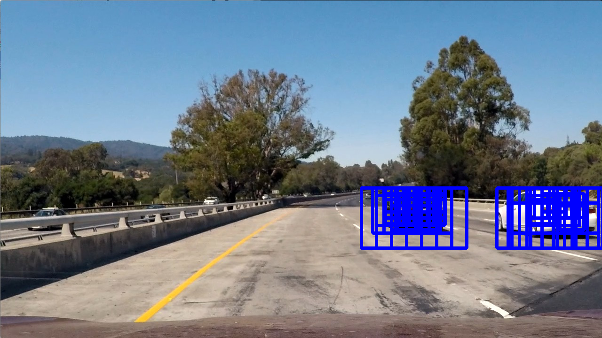
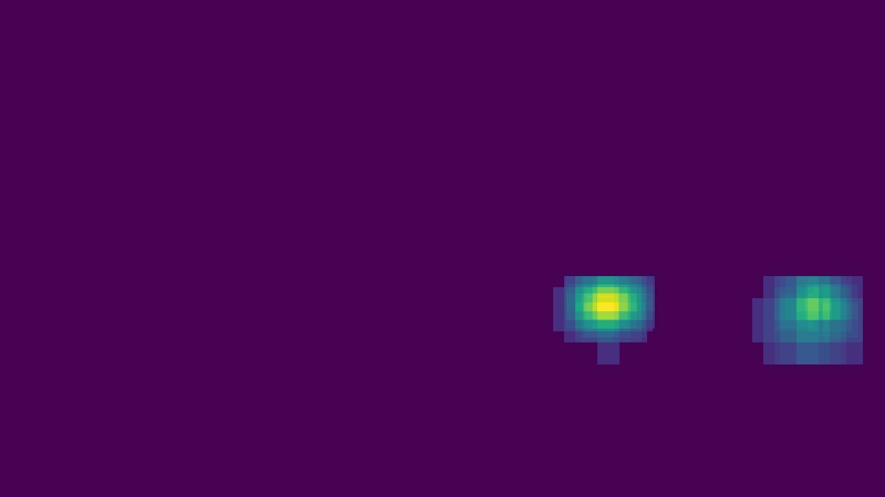

## Writeup

---

**Vehicle Detection Project**

The goals / steps of this project are the following:

* Perform a Histogram of Oriented Gradients (HOG) feature extraction on a labeled training set of images and train a classifier Linear SVM classifier
* Optionally, you can also apply a color transform and append binned color features, as well as histograms of color, to your HOG feature vector. 
* Note: for those first two steps don't forget to normalize your features and randomize a selection for training and testing.
* Implement a sliding-window technique and use your trained classifier to search for vehicles in images.
* Run your pipeline on a video stream (start with the test_video.mp4 and later implement on full project_video.mp4) and create a heat map of recurring detections frame by frame to reject outliers and follow detected vehicles.
* Estimate a bounding box for vehicles detected.

## [Rubric](https://review.udacity.com/#!/rubrics/513/view) Points
### Here I will consider the rubric points individually and describe how I addressed each point in my implementation.  

---
### Writeup / README

#### 1. Provide a Writeup / README that includes all the rubric points and how you addressed each one.  You can submit your writeup as markdown or pdf.  [Here](https://github.com/udacity/CarND-Vehicle-Detection/blob/master/writeup_template.md) is a template writeup for this project you can use as a guide and a starting point.  

You're reading it!

### 1. Get the training sets images

First, I use glob to get car images and not car images.

### 2. Extract features

#### 2.1 Compute color historgram

Here, compute the three channels of histogram of images to get the color histogram features.

#### 2.2 Compute spatial features

Here, compute the three channels of spatial size.
The default size is (32,32).

#### 2.3 Compute HOG features

I used hog function from skimage.feature to get the hog features and hog images.

##### one of the car images and its hog image in three channels are:

 
 
 
 
 

 
 
 
 

##### one of the not car images and its hog image in three channels are:

 
 
 
 
 

 
 
 
 
 
 

#### 2.4 Combine and extract featrues

After 2.1 and 2.3, I can get the color histograme features, spatial features and hog features. Here, I combined these features.

### 3. Training

As the images in data sets had been read in Part 1 and also features extract method is available in Part 2.
Here, extract the features from the images, including cars and not cars.
Labels also are added as 1 is car, 0 is not car.
Then I use LinearSVC to train the data sets. Before the training, I spit the data sets for training and testing via train_test_split() function.

when extract hog features, as the input image in the data set is 64 x64, I use the orient value 9, pix_per_cell 8 and cell_per_block 2 as the parameter values.

I used Linear SVC to train the data, and test it after trarining.

### 4. Find cars

Here, find_cars() function was defined to process the input image.
A region of the input image was got for searching cars, for that the car shall not be possible to appear in the sky.
As the same as training process, the color histogram features, the spatial features and hog features are extracted and  combined as the input of svc for predict. If the predict is good, record the rectangle position information.

Considering the size of the car may be diffrent based on the distance to the camera, multi-scales are used to find cars.

### 5. Apply to one image

Here is the pipeline to handle one image to find cars and also draw the region of the car.

Heat map are also used to remove multiple detections and false positives.

I tested the test 6 images in './test_images/'.

one of the heatmap is:

The label image is:

The test result of the image is:

### 6. Apply to video

The video output is in the path "./output_video/vehicle_detection.mp4".

[video1](./output_video/vehicle_detection.mp4)

---

### Discussion

#### 1. Briefly discuss any problems / issues you faced in your implementation of this project.  Where will your pipeline likely fail?  What could you do to make it more robust?

At first, I found that test image 3 and test image 5 are some difficult to handle and balance. When the heatmap threshold is small, there are some false positve in test image 5. But when I increase the heatmap threshold to remove these false positive, the car in test image 3 will not be detected. 

For this issue, there may be some improve about car classifier, LinearSVC().
The default value of parameter C in LinearSVC() is 1.0. Under this setting, the accuracy of test data is about 98.60%. 
Then I tried the cases that parameters C is 0.9, 0.2, 0.1, 0.008, trained and tested the data. The test results shows that the accuracy is always about 98.00% ~ 98.90%. 
As for the test images, the car detection rectangle num is increasing.So when I decreased the parameter C, I also increased the heatmap threshold. There is some help, but there are still some error detection.

Deep learning might be also involved and the car detection result can be according to multi-object-regconition method paralelly. There may be some help to improve the performance of the car detection.

Another problem is the time cost of finding the cars. This will be more import in real driving. I wonder weather the time performance can meet the requriment in the highway. 

Update 1st:
(1) I cropped some not cars images from the project video and added them into the not car images.
(2) I adopted the reviewers suggestions, uesd RandomizedSearchCV to optimize the classifier hyperparameter C.
And also used deque to store the heatmap of previous frames, increased the threshold.

Update 2nd:
(1) Select the 'YCrCb' space.
(2) Decrease deque max len to decrease the previous frame effect.

Update 3rd:
One main problem about the previous code and video is that I draw the boxes found in the function "find_cars". It mean that when boxes are found, the boxes will be added into the image or video. Even the heatmap and deque are used in the following process, these added boxes can not be remove. It leads to the case that it seems that there are a lot of false postive. 
